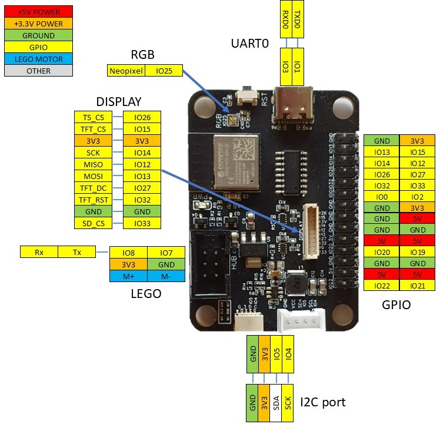

.. currentmodule:: pinout
.. _pinout:

LMS-ESP32v2 Pinout
============================

The graph above shows the pinout of the LMS-ESP32v2 expansion board. All ESP32 GPIO pins are indicated. Where they have a specific functions, that is idicated by an extra pin label.