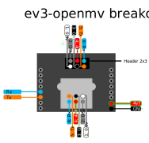

###############################
Hardware description and pinout
###############################

LMS-ESP32
=========
The versatile ESP32 board with LEGO Technic dimensions to connect
Arduino, i2c, i2s, spi, and other hardware to your LEGO.
Get one here:
https://www.antonsmindstorms.com/product/wifi-python-esp32-board-for-mindstorms/

|Esp32 wifi board|

.. toctree::
   :maxdepth: 1
   :titlesonly:
   
   LMS-ESP32/hardware.rst
   LMS-ESP32/pinout.rst
   LMS-ESP32/Assembling-the-esp32-board.rst
   LMS-ESP32/Troubeshooting-your-LMS-ESP32-board.rst
   

spike-openmv smart camera board with 5V power supply - pinout
=============================================================
This board is built for SPIKE Prime and Robot Inventor hubs. 
It follows the pinout of an OpenMV camera, but it can be used with a Huskylens too.
To get 5V you need to force the LEGO hub to supply 8V on the M+ lead (100% motor power).
Use it with :doc:`PUPRemote <../Software/PUPRemote/docs/index>` on SPIKE3 and Pybricks.
Use it with :doc:`SerialTalk </Software/SerialTalk/docs/index>` on SPIKE2 and Robot Inventor. 
Here's the pinout of the spike-openmv board.

|spike-openmv pinout|

ev3-openmv smart camera board - pinout
=============================================================
This board is a breakout board for EV3 Intelligent Bricks.  
It follows the pinout of an OpenMV camera, but it can be used with a Huskylens too.
Use it with :doc:`SerialTalk </Software/SerialTalk/docs/index>` for general serial applications.
You can also use it with `PyHuskyLens <https://github.com/antonvh/PyHuskyLens>`_ on that hardware.
Here's the pinout of the ev3-openmv board.

|ev3-openmv pinout|

Deprecated: OpemMV Uart Convertor board
=======================================
This board is not for sale anymore. It is superseded by the LMS-ESP32, spike-openmv,
and ev3-openmv boards.

The OpemMV Uart Converter board is a LEGO MINDSTORMS breakout board to the size of an OpenMV Camera.
You can use it without a camera as a regular breakout board too. Just
don't solder 8-pin headers on the sides.
Get one here:
https://www.antonsmindstorms.com/product/uart-breakout-board-for-spike-and-ev3-openmv-compatible/

|OpenMV breakout|

.. toctree::
   :maxdepth: 1

   OpenMV convertor board/Assembling-the-converter-board.rst

Deprecated: Distance Sensor Breakout board
==========================================
This board is not for sale anymore. It is superseded by the LMS-ESP32, spike-openmv,
and ev3-openmv boards.

|distance sensor breakout|

.. toctree::
   :maxdepth: 1

   Distance Sensor Breakout Board/Assembling-the-distance-sensor-breakout.rst

Deprecated: LMS-ESP8266
=======================
This board is not for sale anymore. It is superseded by the LMS-ESP32 board.

|Esp8266 wifi board|

.. toctree::
   :maxdepth: 1

   LMS-ESP8266/Arduino-environment.rst
   LMS-ESP8266/Configure-webrepl.rst
   LMS-ESP8266/Connecting-via-webrepl.rst
   LMS-ESP8266/Flashing-the-ESP-boards.rst 

.. |Esp32 wifi board| image:: LMS-ESP32/images/esp32-wifi.jpg
   :width: 400
.. |OpenMV breakout| image:: OpenMV\ convertor\ board/images/Breakout.jpg
   :width: 400
.. |distance sensor breakout| image:: Distance\ Sensor\ Breakout\ Board/images/Distance-breakout.jpg
   :width: 400
.. |Esp8266 wifi board| image:: LMS-ESP8266/images/Breakout-BUNDLE.jpg
   :width: 400
.. |spike-openmv pinout| image:: images/spike-openmv.svg
   :width: 800
