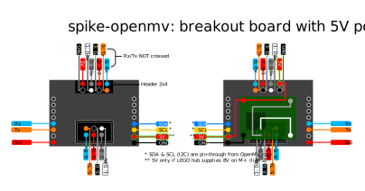
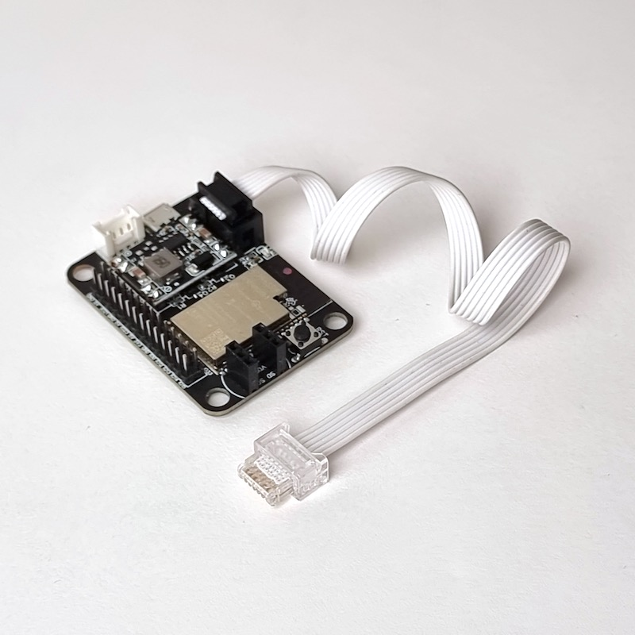
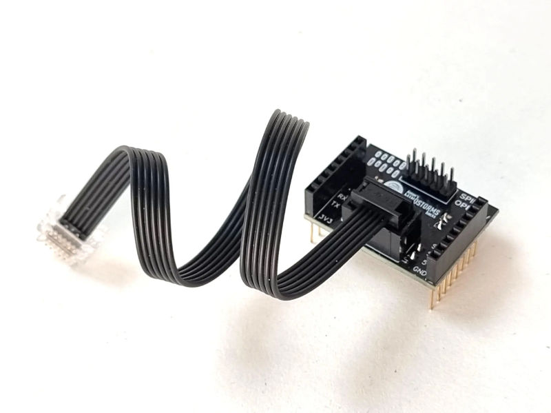
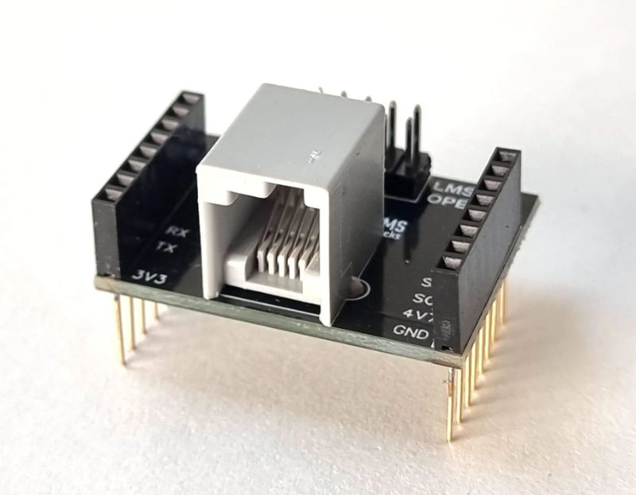
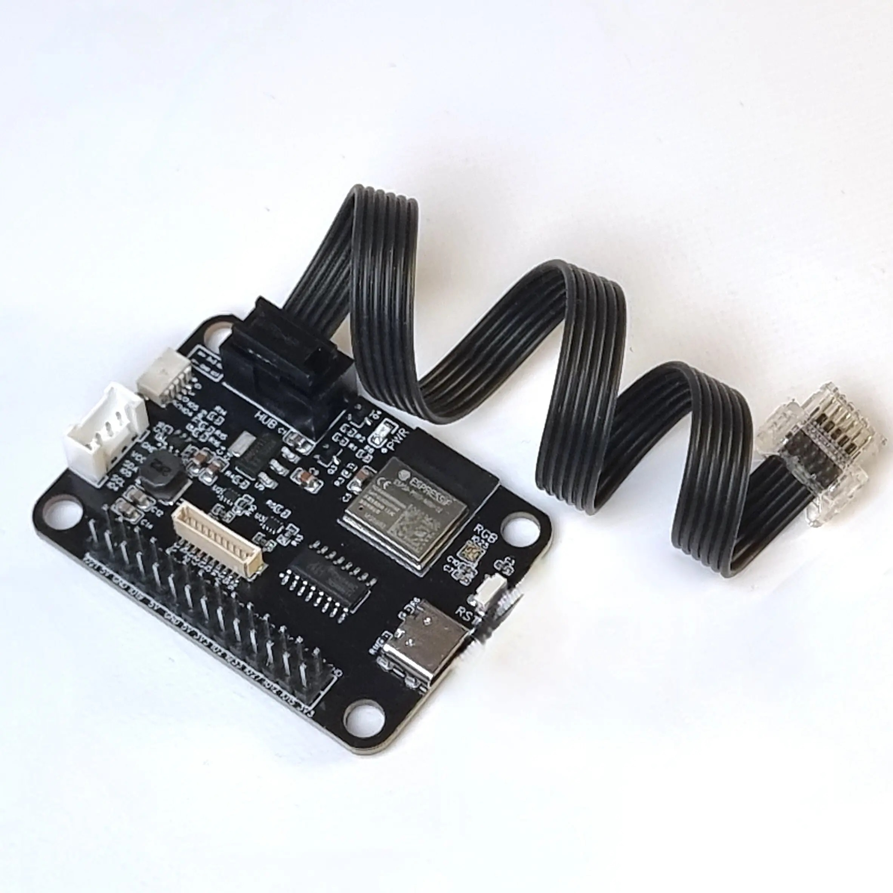

######################
Hardware documentation
######################

Here's an overview of the documentation of all PCB's (Printed Circuit Boards) 
we produced on https://antonsmindstorms.com. 

LMS-ESP32-v2
============
The improved version of the `WiFi Python LMS-ESP32v2 board for MINDSTORMS and SPIKE <https://www.antonsmindstorms.com/product/wifi-python-esp32-board-for-mindstorms/>`__ 
connects servos, arduino, i2c, i2s, spi, grpahics display, and other hardware to your LEGO. 

.. toctree::
   :maxdepth: 1
   :glob:
   :titlesonly:
   
   LMS-ESP32v2/*
   

|lms-esp32v2|

LMS-ESP32-v1.0
==============
The versatile `WiFi Python LMS-ESP32 board for MINDSTORMS and SPIKE <https://www.antonsmindstorms.com/product/wifi-python-esp32-board-for-mindstorms/>`__ 
connects servos, arduino, i2c, i2s, spi, and other hardware to your LEGO. 

.. toctree::
   :maxdepth: 1
   :glob:
   :titlesonly:
   
   LMS-ESP32/*
   

|lms-esp32|

SPIKE Smart Camera Breakout Board (spike-openmv)
================================================
This board is built for SPIKE Prime and Robot Inventor hubs. 
It follows the pinout of an OpenMV camera, but it can be used with a Huskylens too.

.. toctree::
   :maxdepth: 1

   spike-openmv

|spike-openmv|

EV3 Smart Camera Breakout board (LMS-EV3-OPENMV)
================================================
The `LMS-EV3-OPENMV <https://www.antonsmindstorms.com/product/ev3-smart-camera-breakout-board-lms-ev3-openmv/>`__
board is a breakout board for EV3 Intelligent Bricks.  

.. toctree::
   :maxdepth: 1

   lms-ev3-openmv

|lms-ev3-openmv|

Deprecated: OpemMV Uart Convertor board
=======================================
This board is not for sale anymore. It is superseded by the LMS-ESP32, spike-openmv,
and ev3-openmv boards.

The OpemMV Uart Converter board is a LEGO MINDSTORMS breakout board 
to the size of an OpenMV Camera.
You can use it without a camera as a regular breakout board too. 

.. toctree::
   :maxdepth: 1

   OpenMV convertor board/Assembling-the-converter-board.rst

|OpenMV breakout|

Deprecated: Distance Sensor Breakout board
==========================================
This board is not for sale anymore. It is superseded by the LMS-ESP32, spike-openmv,
and ev3-openmv boards.

.. toctree::
   :maxdepth: 1

   Distance Sensor Breakout Board/Assembling-the-distance-sensor-breakout.rst

|distance sensor breakout|

Deprecated: LMS-ESP8266
=======================
This board is not for sale anymore. It is superseded by the LMS-ESP32 board.

.. toctree::
   :maxdepth: 1

   LMS-ESP8266/Arduino-environment.rst
   LMS-ESP8266/Configure-webrepl.rst
   LMS-ESP8266/Connecting-via-webrepl.rst
   LMS-ESP8266/Flashing-the-ESP-boards.rst 

|Esp8266 wifi board|

.. |Esp32 wifi board| image:: LMS-ESP32/images/esp32-wifi.jpg
   :width: 400
.. |OpenMV breakout| image:: OpenMV\ convertor\ board/images/Breakout.jpg
   :width: 400
.. |distance sensor breakout| image:: Distance\ Sensor\ Breakout\ Board/images/Distance-breakout.jpg
   :width: 400
.. |Esp8266 wifi board| image:: LMS-ESP8266/images/Breakout-BUNDLE.jpg
   :width: 400

